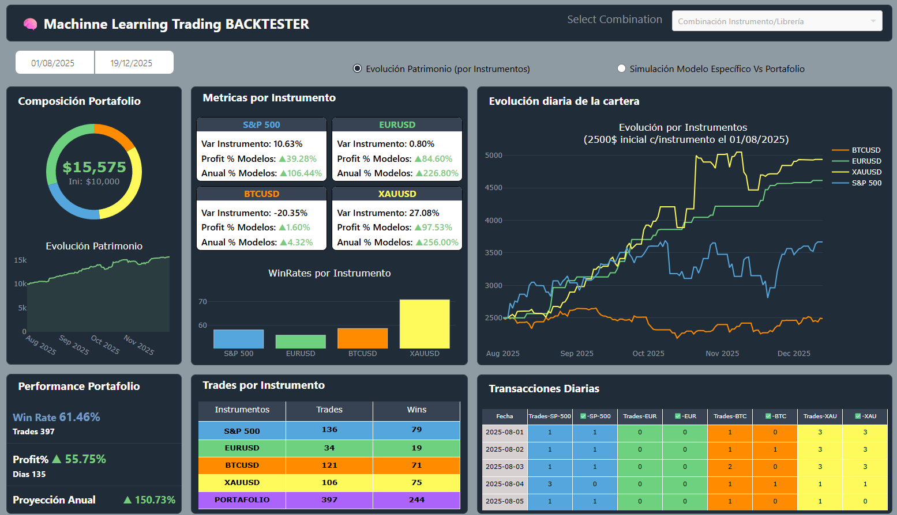
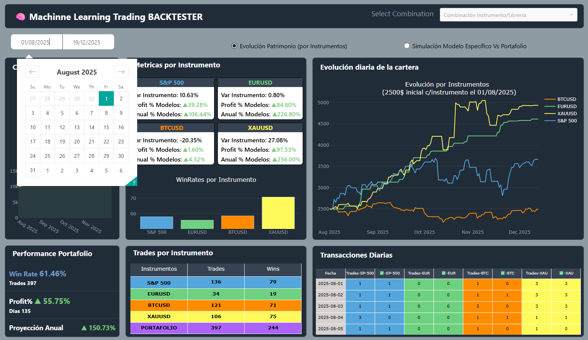

# 🚀 Dashboard de Backtesting con Machine Learning


Este proyecto es una aplicación interactiva de alto rendimiento construida con **Dash** para la visualización de predicciones y resultados de backtesting. El sistema integra modelos de Inteligencia Artificial para el análisis de instrumentos financieros, permitiendo explorar el rendimiento de carteras, tasas de acierto y simulaciones de trading diario en un entorno visual profesional.

---

## 📈 Instrumentos Financieros Cubiertos

El dashboard analiza los activos más representativos para una diversificación estratégica:

*   **S&P 500 (SPX):** El índice bursátil más importante de los EE.UU.
*   **EUR/USD:** El par de divisas líder del mercado Forex.
*   **BTC/USD:** La criptomoneda referente frente al dólar.
*   **XAU/USD:** El Oro, el activo refugio por excelencia a nivel global.

---

## 🛠️ Stack Tecnológico y Modelos

Hemos implementado un conjunto robusto de librerías para cubrir diversas arquitecturas de predicción:

*   **Machine Learning (Clásicos & Ensembles)**:
    *   **Sklearn**: Base para preprocesamiento y modelos tradicionales.
    *   **LightGBM**: Algoritmos de gradiente rápido.
    *   **XGBoost**: Clasificación de alto rendimiento.
*   **Deep Learning (Redes Neuronales)**:
    *   **PyTorch**: Modelos de redes neuronales personalizadas.
    *   **TensorFlow**: Implementaciones robustas para series temporales.

---

## ⚙️ Arquitectura del Sistema (El Flujo)

Dada la complejidad del pipeline, el proyecto se divide en **3 subsistemas independientes**:

1.  **Obtención de Datos**: Repositorio [`Actualiza-Data-Instrumentos`](https://github.com/aliskairraul/Actualiza-Data-Instrumentos). Realiza web-scraping y peticiones API diariamente.
2.  **Predicción (Inferencias)**: Repositorio [`Inferencias_instrumentos_dic_2025`](https://github.com/aliskairraul/Inferencias_instrumentos_dic_2025). Procesa la data con modelos pesados (TensorFlow/PyTorch) y persiste los resultados en Parquet.
3.  **Visualización (Este Repositorio)**: El Dashboard de Dash que consume las inferencias y ejecuta el motor de backtesting dinámico.

---

## 🧠 Estrategia de Backtesting y Lógica de Decisión

La rentabilidad se busca a través de una gestión de riesgos disciplinada:

*   **Capital Inicial**: Simulamos con **$10,000**, distribuidos equitativamente entre los 4 instrumentos.
*   **Votación por Mayoría**: Cada librería emite un "voto". Si hay consenso, se opera con el capital disponible para ese activo.
*   **Gestión de Dirección**: En casos de votos divididos (ej. 3 al alza, 2 a la baja), se opera proporcionalmente a la fuerza del consenso (ej. 20% al alza).
*   **Filtro de Seguridad**: No se opera si la probabilidad estimada por los modelos no alcanza el unbral óptimo.

> [!IMPORTANT]
> Los modelos predicen la dirección del precio para el **día siguiente**. El backtest contempla una única operación diaria por instrumento, incluyendo costos operativos.

---

## 📊 Componentes del Dashboard

La aplicación se estructura en 6 bloques principales de información:

1.  **Composición Portafolio (Dona)**: Visualiza la distribución actual del capital. En el centro el Capital Actual e Inicial de la simulación.
2.  **Performance Portafolio**: Métricas clave como Profit %, WinRate (Tasa de Aciertos) y Proyección Anualizada.
3.  **Métricas por Instrumento**: Comparativa de la variación del precio real vs. el profit generado por la estrategia.
4.  **Trades por Instrumento**: Detalle cuantitativo de operaciones y aciertos por cada activo.
5.  **Evolución Diaria**: 
    *   *Patrimonio*: Curva de crecimiento de cada sub-cartera.
    *   *Modelo Vs Portafolio*: Comparativa directa entre un modelo individual y la estrategia diversificada.
6.  **Transacciones Diarias**: Registro detallado día a día de trades y aciertos.

---

## 🚀 Pasos para la Ejecución

### 1. Clonar el repositorio
```bash
git clone https://github.com/aliskairraul/MachinneLearningBacktesterDic2025.git
cd MachinneLearningBacktesterDic2025
```

### 2. Instalación de dependencias
```bash
pip install -r requirements.txt
```

### 3. Ejecutar el Dashboard
```bash
python main.py
```
*Acceder a través de `http://127.0.0.1:8050`*

---

## 🎥 Visualización del Proyecto


*Vista principal al cargar la aplicación.*


*Componente interactivo para ajuste de periodos de estudio.*


*Diagrama de interacción entre los 3 repositorios.*

---

## 🤝 Contacto y Portafolio

*   **LinkedIn**: [Aliskair Rodriguez](https://www.linkedin.com/in/aliskair-rodriguez-782b3641/)
*   **GitHub**: [@aliskairraul](https://github.com/aliskairraul)
*   **Email**: [aliskairraul@gmail.com](mailto:aliskairraul@gmail.com)
*   **Web/Portfolio**: [aliskairraul.github.io](https://aliskairraul.github.io)
*   **Despliegue Live**: [Plotly Cloud Link](https://ef5576ef-9622-420c-8f49-8e5f7facc205.plotly.app)

---
*Desarrollado con ❤️ para el análisis avanzado de mercados financieros.*
